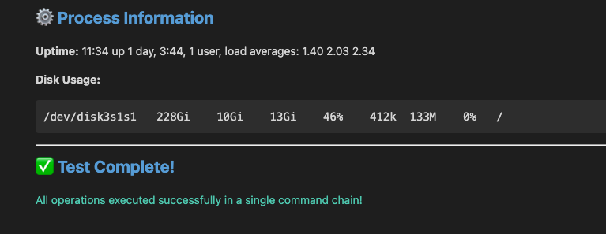
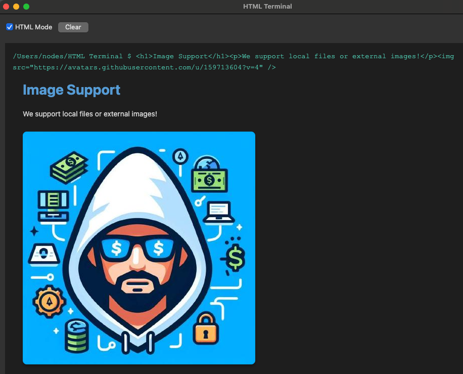

# HTML Terminal

A modern terminal application that can render HTML content alongside executing regular shell commands.

## Features

- **HTML Rendering**: Render HTML content directly in the terminal with proper styling
- **HTML Mode Toggle**: Switch between HTML rendering and plain text mode
- **Command Execution**: Execute normal terminal commands (bash, zsh, etc.)
- **HTML-Wrapped Commands**: Wrap commands in HTML tags to render their output with styling
  - Example: `<h1>echo 'Hello World'</h1>` - executes the command and wraps output in h1 tags
- **Command History**: Use up/down arrows to navigate through command history
- **Dark Theme**: Modern dark theme optimized for terminal use
- **Responsive**: HTML content is rendered responsively







## Installation

1. Install Python dependencies:
```bash
pip install -r requirements.txt
```

**Quick Start** (recommended):
```bash
python -m venv ./venv
./run.sh
```

Or activate the virtual environment and run manually:
```bash
python -m venv ./venv
source venv/bin/activate
python html_terminal.py
```

## Examples

### Regular Commands
```bash
ls -la
pwd
echo "Hello World"
```

### HTML Content
```html
<h1>This is a heading</h1>
<p>This is a <strong>paragraph</strong> with <em>formatting</em>.</p>
<ul>
  <li>Item 1</li>
  <li>Item 2</li>
</ul>
```

### HTML-Wrapped Commands
```bash
<h1>echo "Big Header"</h1>
<h2>date</h2>
<p>ls -la</p>
<code>pwd</code>
```

### Complex Example
```bash
echo "This is test data" > test-html-terminal.txt && echo "<div style='padding: 20px;'><h1>🚀 HTML Terminal Comprehensive Demo</h1><hr><h2>📅 System Information</h2><p><strong>Date & Time:</strong> $(date)</p><p><strong>Current Directory:</strong> $(pwd)</p><p><strong>User:</strong> $(whoami)</p><p><strong>System:</strong> $(uname -s)</p><hr><h2>📁 File Operations</h2><p>Writing to test-html-terminal.txt...</p><pre>$(cat test-html-terminal.txt)</pre><p><strong>File created with $(wc -l < test-html-terminal.txt) lines</strong></p><hr><h2>📂 Directory Listing</h2><table><thead><tr><th>Permissions</th><th>Size</th><th>Name</th></tr></thead><tbody><tr><td colspan='3'><pre>$(ls -lh | head -10)</pre></td></tr></tbody></table><hr><h2>🌐 Online Data Fetching</h2><h3>GitHub Zen Quote:</h3><blockquote style='background: #2d2d2d; padding: 15px; border-left: 4px solid #569cd6;'>$(curl -s https://api.github.com/zen 2>/dev/null || echo 'Network request demo')</blockquote><h3>Weather Info:</h3><pre>$(curl -s 'https://wttr.in/?format=3' 2>/dev/null || echo 'Weather service demo')</pre><hr><h2>⚙️ Process Information</h2><p><strong>Uptime:</strong> $(uptime)</p><p><strong>Disk Usage:</strong></p><pre>$(df -h / | tail -1)</pre><hr><h2>✅ Test Complete!</h2><p style='color: #4ec9b0;'>All operations executed successfully in a single command chain!</p></div>"
```

### Image Support
Display images from URLs or local files:
```html


```

You can also combine images with commands:
```bash
<div><h2>My Screenshot</h2></div>
```

### Toggle HTML Mode
- Check/uncheck the "HTML Mode" checkbox to switch between HTML rendering and plain text
- In plain text mode, HTML tags are stripped and content is displayed as plain text

## Keyboard Shortcuts

- **Enter**: Execute command
- **Up Arrow**: Previous command in history
- **Down Arrow**: Next command in history

## Technical Details

- Built with PyQt6 for cross-platform GUI support
- Uses QWebEngineView (Chromium-based) for HTML rendering
- Executes commands via subprocess in the current shell environment
- Supports directory navigation with `cd` command

